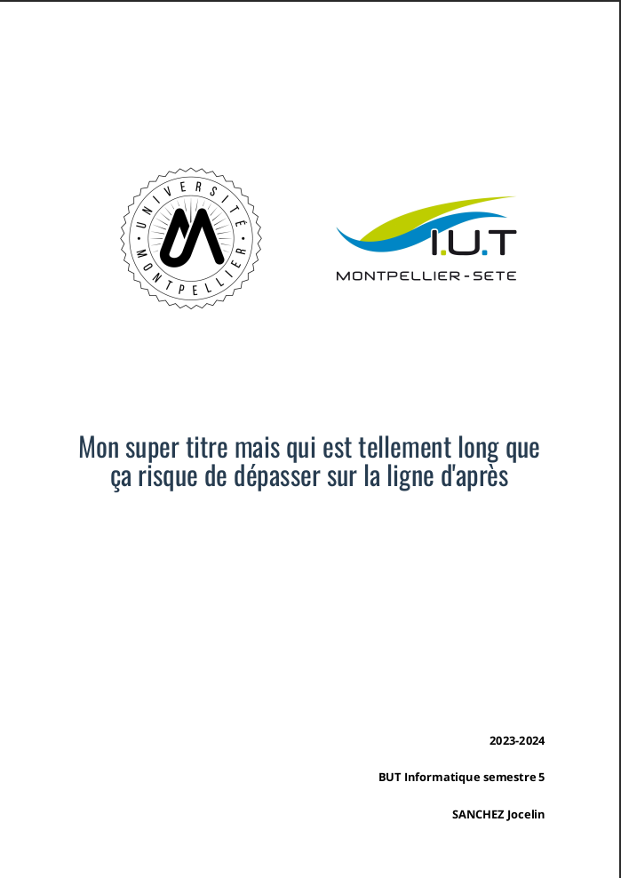
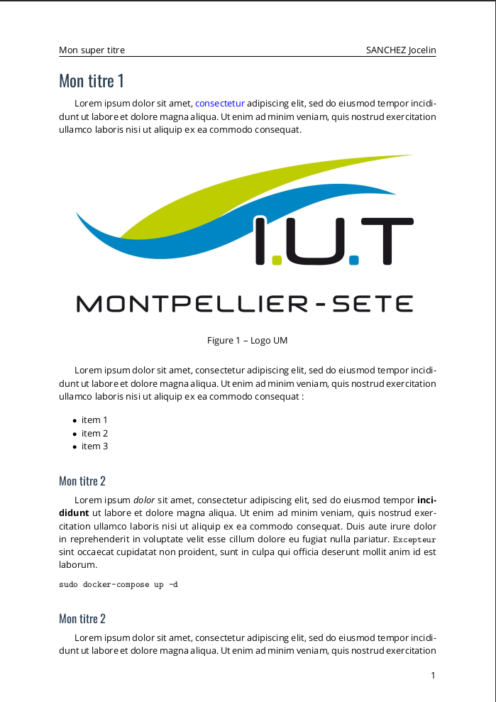

# IUTexTemplate

Template [LaTeX](https://wikipedia.org/wiki/LaTeX) permettant l'export de fichiers Markdown en PDF correspondants à la [charte graphique de l'IUT de Montpellier-Sète](https://iut-montpellier-sete.edu.umontpellier.fr/files/2020/09/Charte-graphique-de-lIUTMS-Septembre-2020.pdf).

## Prévisualisation

| Page de garde  | Page quelconque |
| :------------: | :-------------: |
| [](examples/output.pdf) | [](examples/output.pdf) |


## Pré-requis

- [Pandoc](https://pandoc.org/)
- Multiples packages LaTeX (à renseigner)
- LuaLaTeX ou XeLaTeX

## Utilisation

Après avoir récupéré [`IUTexTemplate`](IUTexTemplate.tex) et le dossier [`ressources/`](ressources) vous pouvez convertir votre fichier :

```bash
pandoc votre_fichier_markdown.md --pdf-engine=lualatex --template=IUTexTemplate -o output.pdf
```

Notez que certaines métadonnées seront récupérées directement dans le markdown au début de celui-ci :

```markdown
---
title: Mon super titre mais qui est tellement long que ça risque de dépasser sur la ligne d'après
shorttitle: Mon super titre
author: SANCHEZ Jocelin
semester: 5
schoolyear: 2023-2024
---
``` 

Vous pouvez voir l'exemple dans [`markdown.md`](example/markdown.md).